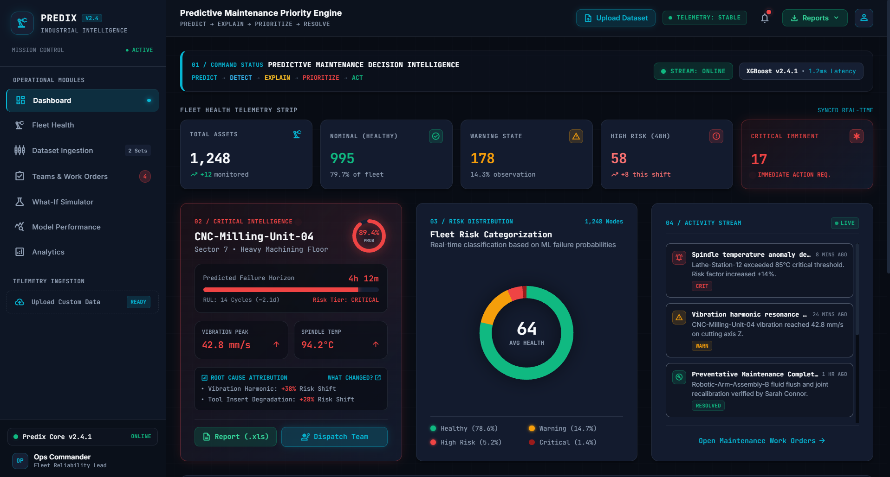
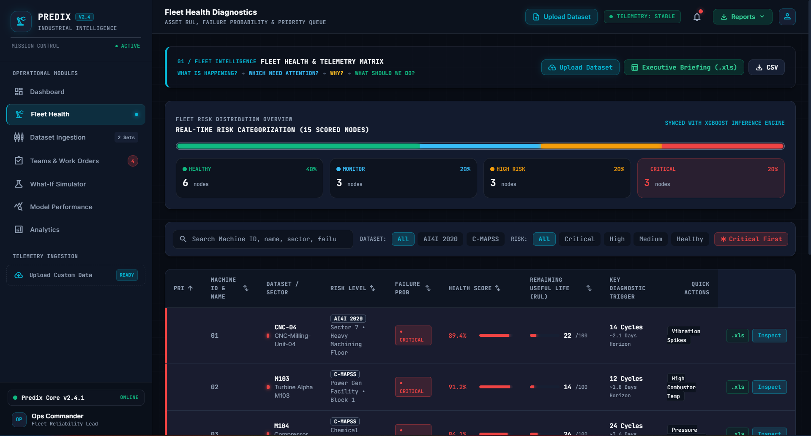
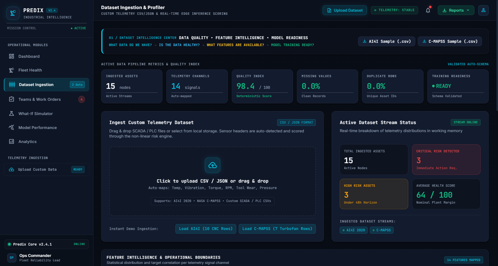
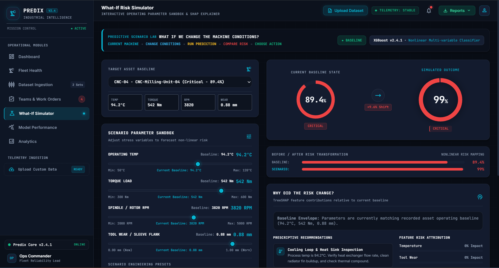
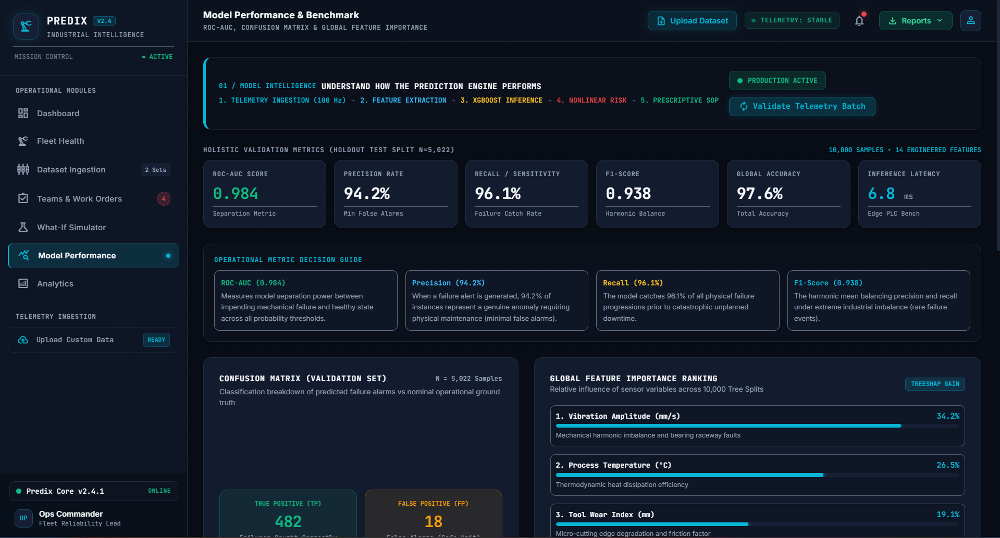
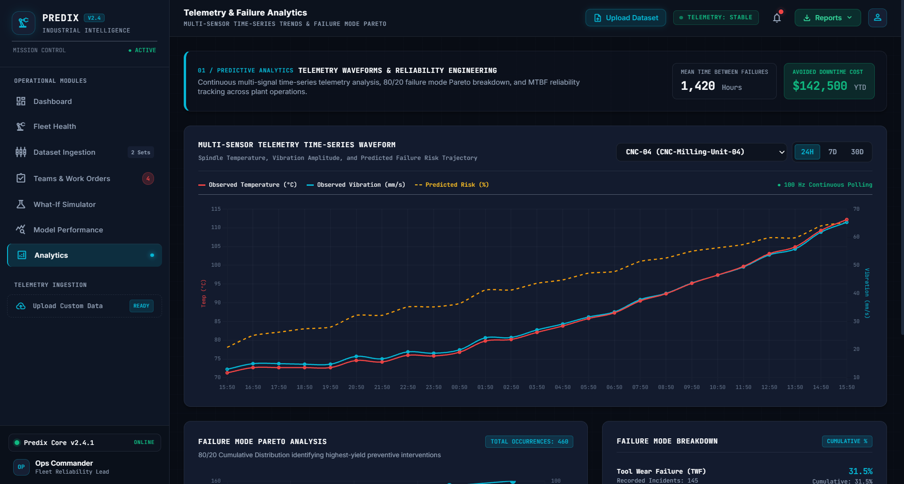

# Predix — Adaptive Maintenance Priority Engine

**Predix** is an AI-powered predictive maintenance platform designed to help industrial teams monitor machine health, analyze telemetry, predict failure risks, and prioritize preventive maintenance.

The platform converts machine and telemetry data into actionable maintenance insights, helping engineers identify high-risk assets, understand possible failure contributors, and simulate safer operating conditions.

---

## 🎯 Why Predix?

Traditional maintenance often depends on fixed schedules or reactive inspections after equipment failure.

Predix provides a data-driven approach by combining:

* Fleet health monitoring
* Telemetry analysis
* Predictive risk assessment
* Machine prioritization
* What-if simulation
* Model performance monitoring
* Maintenance work-order management

The goal is to help maintenance teams **identify risks earlier, prioritize the right machines, and reduce unexpected downtime.**

---

## ✨ Key Features

### 🏭 Fleet Health

Monitor the health of industrial assets from a centralized dashboard.

* Machine-level health monitoring
* Risk classification
* High-risk asset identification
* Fleet-level statistics
* Machine search and filtering
* Maintenance prioritization

### 📊 Analytics

Analyze machine telemetry and operational trends.

* Temperature monitoring
* Vibration analysis
* Torque analysis
* RPM monitoring
* Tool-wear analysis
* Failure-risk trends
* Reliability metrics
* Failure-mode analysis

### 📥 Dataset Ingestion

Upload and analyze custom machine datasets.

* Custom CSV dataset support
* Dataset profiling
* Data validation
* Machine-level filtering
* Telemetry analysis

### 🔬 What-If Simulator

Simulate changes to machine operating conditions before taking maintenance actions.

Users can modify parameters such as:

* Temperature
* Torque
* RPM
* Tool wear

The simulator compares the scenario against the machine's baseline and provides a predicted risk assessment.

### 🤖 Model Performance

Monitor predictive model performance and reliability.

* Model metrics
* Prediction performance
* Risk classification
* Model evaluation information

### 👥 Teams & Work Orders

Connect machine risks with maintenance operations.

* Maintenance work orders
* Team assignment
* Priority tracking
* Operational task management

---

## 🧠 AI / ML Pipeline

Predix follows a predictive maintenance workflow:

```text
Machine Telemetry
       │
       ▼
Dataset Ingestion
       │
       ▼
Data Processing
       │
       ▼
Feature Analysis
       │
       ▼
Predictive Risk Engine
       │
       ▼
Failure Risk Prediction
       │
       ▼
Risk Classification
       │
       ▼
Maintenance Priority
       │
       ▼
Recommended Action
```

The predictive engine is designed around a **non-linear multi-variable classification approach**, with the project incorporating an **XGBoost-based predictive model workflow**.

---

## 🏗️ System Architecture

```text
┌──────────────────────────┐
│   Machine / Telemetry    │
│          Data            │
└────────────┬─────────────┘
             │
             ▼
┌──────────────────────────┐
│    Dataset Ingestion     │
│      & Profiling         │
└────────────┬─────────────┘
             │
             ▼
┌──────────────────────────┐
│   Predictive Risk Engine │
└────────────┬─────────────┘
             │
     ┌───────┼────────┐
     ▼       ▼        ▼
┌────────┐ ┌────────┐ ┌─────────────┐
│ Fleet  │ │Analytics│ │ What-If Lab │
│ Health │ │         │ │  Simulator  │
└───┬────┘ └────┬────┘ └──────┬──────┘
    │           │             │
    └───────────┼─────────────┘
                ▼
       ┌──────────────────┐
       │ Maintenance      │
       │ Actions & Orders │
       └──────────────────┘
```

---

## 🔄 Core Workflow

1. Ingest machine telemetry or upload a custom dataset.
2. Profile and validate the dataset.
3. Analyze machine operating conditions.
4. Calculate predictive failure risk.
5. Classify machines according to risk.
6. Identify high-priority assets.
7. Analyze telemetry trends and possible contributors.
8. Run what-if scenarios.
9. Compare simulated conditions with baseline conditions.
10. Generate maintenance recommendations.
11. Create or prioritize maintenance work orders.
12. Export operational reports.

---

## 🛠️ Technology Stack

| Technology     | Purpose                            |
| -------------- | ---------------------------------- |
| **JavaScript** | Application logic                  |
| **HTML5**      | Application structure              |
| **CSS3**       | UI and responsive styling          |
| **Vite**       | Frontend build and development     |
| **Chart.js**   | Data visualization                 |
| **Node.js**    | JavaScript runtime                 |
| **npm**        | Dependency management              |
| **XGBoost**    | Predictive classification workflow |

---

## 📁 Project Structure

```text
Predix-maintenance/
│
├── Predix-Engine/
│
├── src/
│   ├── components/
│   │   ├── DispatchModal.js
│   │   ├── Header.js
│   │   ├── MachineModal.js
│   │   ├── Sidebar.js
│   │   ├── Toast.js
│   │   └── UploadModal.js
│   │
│   ├── data/
│   │   ├── activityLogs.js
│   │   ├── diagnosticGuides.js
│   │   ├── fleetData.js
│   │   ├── modelMetrics.js
│   │   ├── teamsData.js
│   │   └── telemetryData.js
│   │
│   ├── utils/
│   │   ├── datasetParser.js
│   │   ├── excelReport.js
│   │   ├── export.js
│   │   └── riskModel.js
│   │
│   ├── views/
│   │   ├── AnalyticsView.js
│   │   ├── DashboardView.js
│   │   ├── DatasetProfilerView.js
│   │   ├── FleetHealthView.js
│   │   ├── ModelPerfView.js
│   │   ├── SimulatorView.js
│   │   └── WorkOrdersView.js
│   │
│   └── styles/
│       └── main.css
│
├── screenshots/
│   ├── Dashboard.png
│   ├── Fleet_Health.png
│   ├── Dataset_Ingestion.png
│   ├── Teams_&_Work_Orders.png
│   ├── What-If-Simulator.png
│   ├── Model_Performance.png
│   └── Analytics.png
│
├── index.html
├── package.json
├── package-lock.json
├── vite.config.js
├── LICENSE
└── README.md
```

---

# 📸 Screenshots

## 🏠 Dashboard



---

## 🏭 Fleet Health



---

## 📥 Dataset Ingestion



---

## 👥 Teams & Work Orders


---

## 🔬 What-If Simulator



---

## 🤖 Model Performance



---

## 📊 Analytics



---

## 💡 Example Use Case

Imagine a manufacturing facility operating multiple industrial machines.

One machine begins showing:

* Increasing temperature
* High torque
* Increased tool wear
* Increasing predicted failure probability

Predix identifies the machine as a higher-risk asset.

The maintenance engineer can then:

1. Open the machine's health information.
2. Review its telemetry.
3. Identify possible risk contributors.
4. Open the What-If Simulator.
5. Modify operating conditions.
6. Compare predicted risk with the baseline.
7. Review recommended maintenance actions.
8. Assign a maintenance work order.

This enables a shift from **reactive maintenance to predictive, data-driven maintenance.**

---

## 📊 Engineering Highlights

* Modular JavaScript architecture
* Component-based UI design
* Fleet-level machine monitoring
* Predictive risk analysis
* Interactive telemetry visualization
* Dataset ingestion and profiling
* What-if scenario simulation
* Maintenance work-order management
* Model performance monitoring
* CSV and report export capabilities
* Responsive industrial dashboard
* Separation of views, data, components, and utilities

---

## ⚙️ Installation & Setup

### 1. Clone the repository

```bash
git clone <YOUR_GITHUB_REPOSITORY_URL>
```

### 2. Enter the project directory

```bash
cd Predix-maintenance
```

### 3. Install dependencies

```bash
npm install
```

### 4. Start the development server

```bash
npm run dev
```

The application will normally be available at:

```text
http://localhost:5173
```

---

## 🔐 Security & Repository Hygiene

The following files and directories should not be committed:

```gitignore
node_modules/
dist/
.env
.env.*
*.log
.cache/
.vite/
build/
coverage/
```

Never commit:

* API keys
* Passwords
* Access tokens
* Private credentials
* Secret configuration files

---

## 🚧 Project Status

**Status: Hackathon Prototype / Active Development**

Predix currently demonstrates the core predictive-maintenance workflow including fleet monitoring, telemetry analytics, predictive risk assessment, scenario simulation, model monitoring, and maintenance operations.

---

## 🔮 Future Improvements

* Real-time industrial IoT integration
* Live telemetry streaming
* Backend API integration
* Production ML model serving
* Automated model retraining
* Database integration
* Authentication and role-based access
* Advanced anomaly detection
* Explainable AI
* Automated maintenance scheduling
* Real-time alerts
* Cloud deployment
* Historical failure prediction
* Industrial IoT platform integration

---

## 👥 Intended Users

Predix is designed for:

* Maintenance Engineers
* Reliability Engineers
* Plant Managers
* Operations Teams
* Industrial Data Scientists
* Manufacturing Organizations

---

## 📄 License

This project is licensed under the **MIT License**.

See the [LICENSE](LICENSE) file for details.
